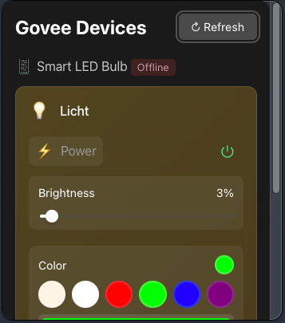

# Govee Statusbar

A macOS menubar application to control your Govee smart devices. Built with Tauri and SvelteKit.



## Features

- 🔌 Control Govee devices directly from your menubar
- 💡 Toggle lights on/off
- ✨ Adjust brightness
- 🌡️ Monitor temperature and humidity sensors
- 🔄 Auto-refresh device states
- 🚀 Fast and lightweight app

## Development

### Prerequisites

- [Node.js](https://nodejs.org/) (v18 or later)
- [pnpm](https://pnpm.io/) (v8 or later)
- [Rust](https://www.rust-lang.org/) (latest stable)
- Xcode Command Line Tools (for macOS)
- A Govee API Key

### Getting Your API Key

1. Open the Govee Home app
2. Go to Profile > Settings
3. Tap "Apply for API Key"
4. Follow the instructions to get your API key

### Setup

1. Clone the repository:
```bash
git clone https://github.com/pumpum7/statusbar-govee.git
cd statusbar-govee
```

2. Install dependencies:
```bash
pnpm install
```

3. Run in development mode:
```bash
pnpm tauri dev
```

### Building

To create a production build:

```bash
pnpm tauri build
```

The built application will be in `src-tauri/target/release/bundle`.

## Contributing

Contributions are welcome! Please feel free to submit a Pull Request.

## Acknowledgments

- Built with [Tauri](https://v2.tauri.app/)
- UI powered by [SvelteKit](https://kit.svelte.dev/)
- Using the [Govee API](https://developer.govee.com/)

